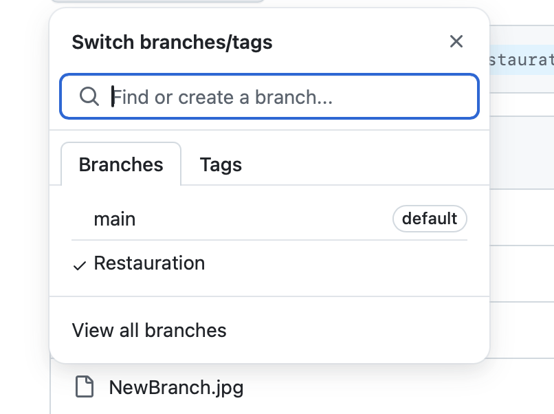
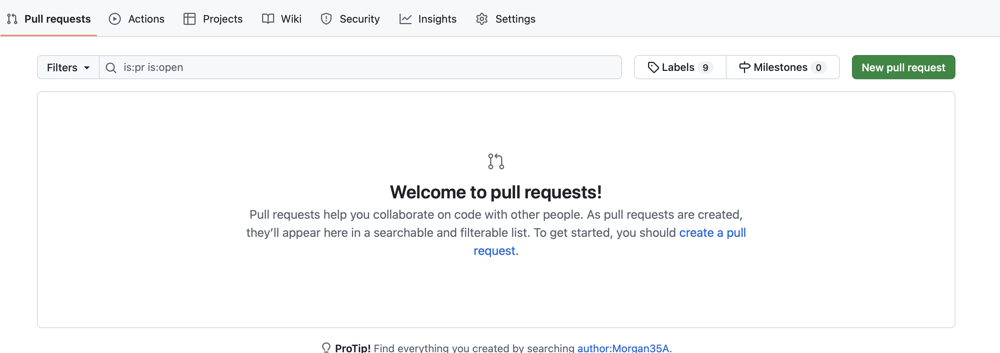

------------------------------------------------------------------------------------------------------
PROCESSUS DE RESTAURATION GITHUB
------------------------------------------------------------------------------------------------------
Suite à une modification de code dans GitHub, votre solution ne fonctionne plus. Vous devez donc restaurer votre code mais comment faire.  

**Exercice :** Ecrire dans ce Readme une procédure pour expliquer étape par étape le processus de restauration d'un code issue de votre historique (vos commits). C'est dire, décivrez comment faire un Checkout depuis l'interfaçe GitHub. Vous trouverez ci-dessous le début de la séquence de restauration.  

-------------------------------------------------------------------------------------------------------
Début de procédure : Historique des commits
-------------------------------------------------------------------------------------------------------
L'historique de vos commits vous donne accès à vos différentes versions de votre code.  
A chaque commit, un point de sauvegarde est créé dans GitHub.  

Cliquez sur Commits pour accèder à votre historique de commits  
  
   

Sélectionnez le sauvegarde que vous souhaitez restaurer.  

   

A présent vous n'êtes plus dans votre branche main (branche principale) mais vous naviguez dans un point de restauration (votre code du passé).  

   

Votre objectif à présent est de faire de ce point de sauvegarde une nouvelle branche pour que vous puissiez ensuite la fusionner avec votre branche principale. C'est à dire faire de cette branche de restauration votre branche main.

Créez votre nouvelle branche.  

   
  
Bravo, vous venez de créer une nouvelle branche.  

  

Pour faire de cette nouvelle branche votre branche principale, vous devez faire un "Pull requets".  

  

Créer une nouvelle branche : 

Maintenant il faut se rendre sur la fenetre pull request :

**Procedure à suivre :**  
1° - Créez vous un compte sur GitHub : https://github.com/  
Si besoin, une vidéo pour vous aider à créer votre propre compte GitHUB : [Créer un compte GitHUB](https://docs.github.com/fr/get-started/onboarding/getting-started-with-your-github-account)  
A noter que **si vous possédez déjà un compte GitHUB, vous pouvez le conserver pour réaliser cet atelier**. Pas besion d'en créer un nouveau.  
Remarque importante : **Lors de votre inscription, utilisez une adresse mail valide. GitHUB n'accepte pas les adresses mails temporaires**  

2° - Faites un Fork du Repository suivant : [CMAKE](https://github.com/OpenRSI/Atelier_CMAKE.git)  
Voici une vidéo d'accompagnement pour vous aider dans les "Forks" : [Forker ce projet](https://youtu.be/p33-7XQ29zQ)    
  
**Travail demandé :** Créé votre compte GitHUB, faites le fork de ce projet et **copier l'URL de votre Repository GitHUB dans la discussion public**.

Notion acquise lors de cette séquence :  
Vous avez appris lors de cette séquence à créer des Repository pour stocker et travailler avec votre code informatique. Vous pourez par la suite travailler en groupe sur un projet. Vous avez également appris à faire des Forks. C'est à dire, faire des copies de projets déjà existant dans GitHUB que vous pourrez ensuite adapter à vos besoins.
  

**C'est vous de créer la suite de cette procedure de restauration**  
